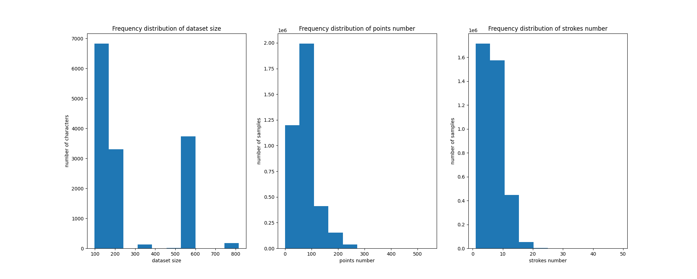
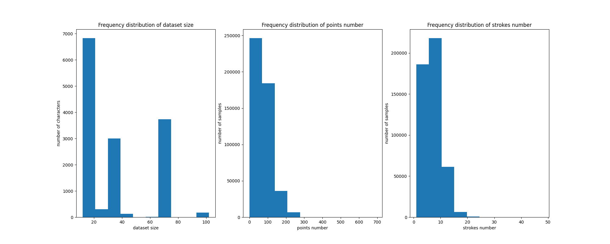
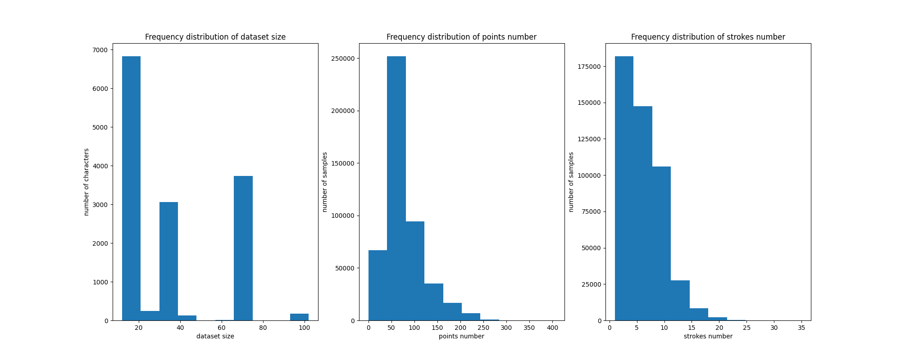

# Pyolhccr

A python library and tools for online handwritten Chinese character recognition.

## Dataset

Run `script/download.sh` to download from CASIA ^[C.-L. Liu, F. Yin, D.-H. Wang, and Q.-F. Wang, [“Online and offline handwritten Chinese character recognition: Benchmarking on new databases,”](https://linkinghub.elsevier.com/retrieve/pii/S0031320312002919) Pattern Recognition, vol. 46, no. 1, pp. 155–162, Jan. 2013.] and HIT-OR3C ^[S. Zhou, Q. Chen, and X. Wang, [“HIT-OR3C: an opening recognition corpus for Chinese characters,”](https://dl.acm.org/doi/10.1145/1815330.1815359) in Proceedings of the 9th IAPR International Workshop on Document Analysis Systems, Boston Massachusetts USA: ACM, pp. 223–230, Jun. 2010.].

||train|valitation| test|
|--|--|--|--|
|number|913 |114 |114 |

||gb1|gb2|gbk|
|--|--|--|--|
|ratio|100% |100% |59.2%|

## Models

### Pattern Recognition

Although most of the pattern recognition methods have been discarded since the introduction of deep learning methods, methods based on such as 8-directional features have been found to improve the performance without increasing the number of parameters.

#### 8-directional features extraction

^[Z.-L. Bai and Q. Huo, [“A study on the use of 8-directional features for online handwritten Chinese character recognition,”](https://ieeexplore.ieee.org/document/1575550) 2005.]

### Deep Learning

#### stroke sequence-dependent CNN

^[X. Liu, B. Hu, Q. Chen, X. Wu, and J. You, [“Stroke Sequence-Dependent Deep Convolutional Neural Network for Online Handwritten Chinese Character Recognition,”](https://ieeexplore.ieee.org/document/8949703) IEEE Transactions on Neural Networks and Learning Systems, vol. 31, no. 11, pp. 4637–4648, Nov. 2020.]

A similar version used in open source [Gboard Physical Handwriting version (Japanese)](https://github.com/google/mozc-devices/blob/master/mozc-nazoru). Developers used both 8-directional features and MobileNet. See [blog post (Apr 1, 2018)](https://developers-jp.googleblog.com/2018/04/tegaki.html) for more details.

#### dual stream GNN

^[X. Jiang, L. Liu, C. Shan, Y. Shen, X. Dong, and D. Li, [“Recognizing Vector Graphics without Rasterization,”](https://arxiv.org/abs/2111.03281) Nov. 2021.]

#### bi-directional RNN with LSTM/GRU

^[X.-Y. Zhang, F. Yin, Y.-M. Zhang, C.-L. Liu, and Y. Bengio, [“Drawing and Recognizing Chinese Characters with Recurrent Neural Network,”](https://arxiv.org/abs/1606.06539) Jun. 2016.]
^[V. Carbune et al., [“Fast Multi-language LSTM-based Online Handwriting Recognition,”](http://arxiv.org/abs/1902.10525) Jan. 2020.]

### Multiple Characters

#### contextual information fusion DSCIFN

^[Y. Li et al., [“Fast and Robust Online Handwritten Chinese Character Recognition With Deep Spatial and Contextual Information Fusion Network,”](https://ieeexplore.ieee.org/document/9682541) IEEE Transactions on Multimedia, vol. 25, pp. 2140–2152, 2023.]
